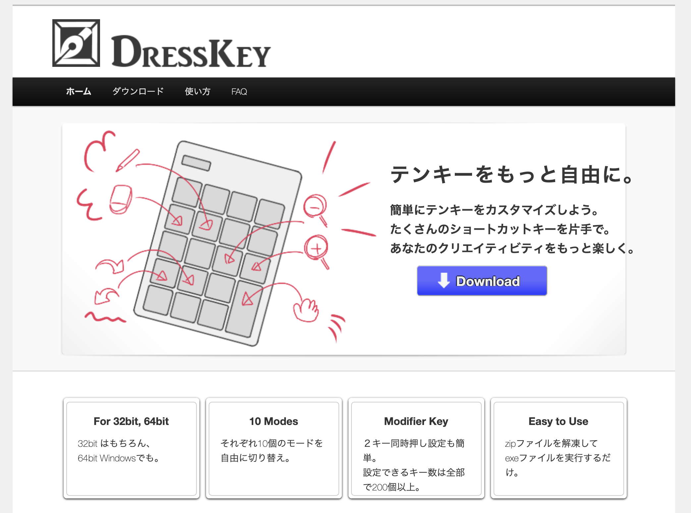
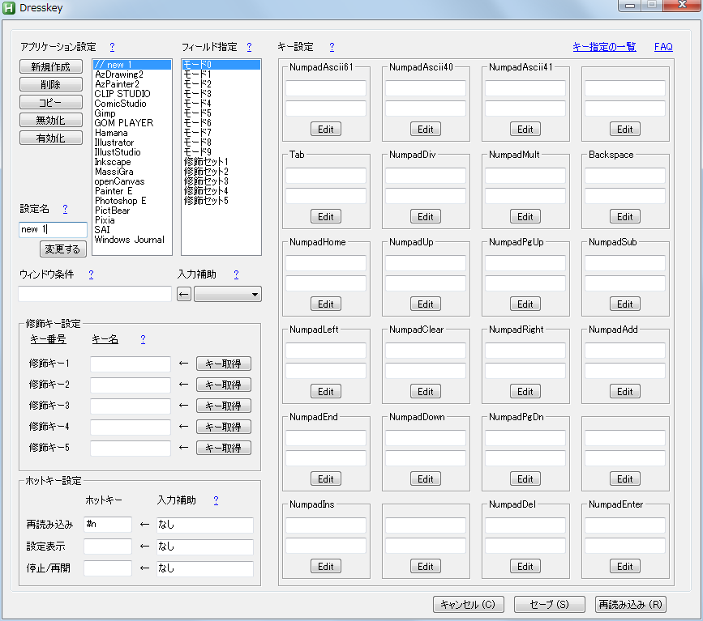

# Dresskey

このページは、Dresskeyというテンキーカスタマイズソフトウェアの公開用跡地です。

現在は持続的にはメンテナンスされていませんが、継続利用いただいて全く問題ありません。

ダウンロードはこちらからできます。片方のみでインストールは十分です。

通常はexeファイルの方を利用ください。
* [exeファイル（こちらがおすすめ）](https://github.com/drssky/dresskey/blob/master/package/dresskey-exe-ver.zip?raw=true)
* [ahkファイル（AutoHotkeyを理解されている上級者向け）](https://github.com/drssky/dresskey/blob/master/package/dresskey-ahk-script-ver.zip?raw=true)

---------------

# アーカイブ

細かな使い方などは、[Wayback Machine のアーカイブ](https://web.archive.org/web/20200321102021/http://ahk.wktk.so/tutorial/how-to-use/) を参照ください。

以下に簡単な機能の概要を記載します。

# 概要

## Dresskeyとは

テンキーを自由にカスタマイズするソフトウェアです。

テンキーのキーにショートカットキーを割り当てることができます。例えば、テンキー0に Ctrl-z を、テンキー1に Ctrl-y を割り当てる、といった使い方が可能です。

## 使うとうれしいこと

* 片手でたくさんのショートカットキーを使える
* 元に戻す（Ctrl-z）も、拡大・縮小も簡単に使い放題
* キーボードに無理に手を伸ばしたりしなくてよくなる
* 右手にペン、左手にテンキー。自然な体勢で使えて体にやさしい
* 片手で楽にショートカット操作を。他のあらゆるPC操作ももっと便利に

## Dresskeyの主な特徴

* 32bit、64bit Windowsで利用可能
* 対象のアプリケーション別に設定できる
* アプリ別設定ごとにそれぞれ10個のモードを自由に切り替え
* ２キー同時押しの設定ができる
* 実質上200個以上のショートカットを一つのテンキーで使える
* グラフィカルに設定できて、使い方も簡単
* テンキー上の=()キーのカスタマイズもできる

## その他の特徴

* メジャーなCGソフトの設定がデフォルトで用意されている
* つまり、ダウンロードしてすぐに使用感を味わえる
* キーストロークの送信がしやすいように特化している
* ワイヤレステンキーを使えばそのままワイヤレスに使える
* AutoHotkey記述ができ、やろうと思えばあらゆる動作を指定できる

## その他のうれしいこと

* テンキーは安い
* テンキーは小さい
* コストが低くて楽に使えるから、簡単に導入を試せる
* テンキーだからキーだってとても押しやすい
* もちろん右利きでも左利きでも

### 対応環境

* Windows XP以降の32bit、64bit Windows

### 更新情報

#### ver 2.2.1 – 2012/09/09

テンキーの=()キーにおいても、カスタマイズ内容を空にしていた場合は元のキーを送信するように変更。

#### ver 2.2.0 – 2012/09/09

テンキー特殊キーである=()キーカスタマイズの安定性を向上。

#### ver 2.1.3 – 2012/09/03

修飾キー設定欄にNumpad系以外のキーを指定できないままになっていた。この現象を修正。

#### ver 2.1.2 – 2012/09/02

デフォルトの登録キーをNumLockオン時のキー名に変更。  
初回起動時のウィンドウメッセージは出ないように変更。  
テンキー上=()キーへのカスタマイズに、関数を指定できないようになっていた。これを修正。

#### ver 2.1.0 – 2012/09/02

マウスボタンを登録するキー名に利用できるように追加。  
ジョイスティックボタンを登録するキー名に利用できるように追加。  
アルファベットキーを利用するキー名に登録していた場合に記述方法によってエラーが生じていた現象を修正。

#### ver 2.0.0 – 2012/09/02

テンキーのキー配置を視覚的に確認しやすいUIに変更。  
NumLock状態を指定するオプションをなくし、使用するキーを個別に登録できるように変更。  
それに合わせて、テンキー以外のキーボードのキーも登録できるように変更。  
テンキー上=()キーをカスタマイズできるように変更。  
カスタマイズ内容に加え、コメントを記述できるように変更。

#### ver 1.4.2 – 2012/08/08

セーブしても「修飾キー設定」の欄に値が表示されないようになっていた。これを修正。

#### ver 1.4 – 2012/08/08

NumLock強制オンのテンキーでも使用できるように、NumLockがオン状態で利用できるように変更するオプションを導入。

#### ver 1.3 – 2012/08/08

Ctrlなどの修飾キーを、よりキーボードと同様の挙動をするように修正。例：テンキー1にCtrl、テンキー2にShiftを設定したとき。テンキー1を押しながらテンキー2を押すと、CtrlとShiftの両方が正しく押し下げ状態になっているように変更。

#### ver 1.2 – 2012/08/02

一つのキーに {Ctrl}{Space} などのように、Spaceも複合的な修飾キーとして利用できるように変更。

#### ver 1.1 – 2012/08/01

Dresskeyを再読み込みした後に設定ウィンドウを早く開きすぎると設定ウィンドウが崩れていた。この現象を修正。

#### ver 1.0 – 2012/07/31

Dresskeyリリース。

